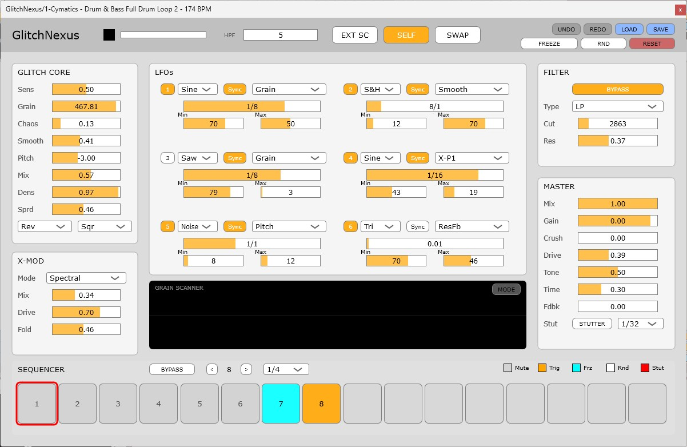

# GlitchNexus v1.0
**Advanced Granular Glitch & Multi-Effect Engine**
---

---

[Disclaimer: Hearing and Equipment Safety]
This software is provided "as-is." In no event shall the developer be liable for any hearing loss, or damage to speakers, headphones, or any other audio equipment resulting from the use of this software.
Extreme settings, particularly within the Resonator (Feedback), X-Mod, and BitCrush sections, may cause unexpected high-decibel peaks and harsh frequencies. Users are strongly advised to start with low volume levels and use protective measures such as limiters. Use of this software is at your own risk.
**GlitchNexus** is a high-fidelity, aggressive granular glitch multi-effect plugin designed for modern electronic music production. Built with C++ and the JUCE framework, it offers a sophisticated balance between chaotic destruction and musical control.
---
Developed by **OTODESK**.

---

## 🌪 The Concept: "Controlled Destruction"
GlitchNexus is not just another random noise generator. It is an **Instant IDM Machine** that allows you to transform simple loops into complex, evolving textures while maintaining rhythmic integrity.

---

## ✨ Key Features

### 1. High-Fidelity Glitch Core
* **Precision Granular Engine:** High-quality interpolation for smooth pitch shifting and glitching.
* **Dynamic Expression:** Controls for `Density`, `Stereo Spread`, and `Direction` (Forward, Reverse, Alternate, Random).
* **Window Shaping:** Choose between Triangle, Sine, Square, and Sawtooth grain envelopes.

### 2. X-Mod Engine (Cross-Modulation)
* **Spectral (Wavefolder):** Harsh, digital harmonic folding for aggressive textures.
* **AM (Diode Ring Mod):** Classic metallic clang with adjustable drive and tone.
* **FM (Delay-Line FM):** True frequency modulation using ultra-short delay lines.

### 3. Smart 16-Step Sequencer
* **Multi-State Steps:** Each step can be assigned to **Mute, Trig, Freeze, Random, or Stutter**.
* **Safe Randomization:** A "Musical Random" button that explores new sounds without breaking your gain staging or routing infrastructure.
* **Visual Tracking:** Real-time playback position and length-based step deactivation.

### 4. Dual Visualizer System
* **Mode A: Ghost Horizon:** Overlays Input (Gray) and Output (Orange) waveforms to visualize the "sonic gap" created by glitching.
* **Mode B: Grain Scanner:** Visualizes individual grains as they scan the buffer in real-time.

### 5. Master FX Chain (The Finisher)
* **Resonator:** Robot-voice delay and feedback for metallic resonances.
* **BitCrush & Downsample:** Digital grit and aliasing control.
* **Drive & Tone:** Analog-style saturation and a Tilt EQ to polish or darken the final output.

---
### 📖 User Manual
For detailed instructions on all parameters and advanced synthesis techniques, please refer to the:
👉 [**GlitchNexusl User Manual (PDF)**](GlitchNexus_UserManual.pdf)

## ⚖ License
This project is licensed under the **GNU General Public License v3.0 (GPLv3)**. 

Since this plugin is built using the [JUCE framework](https://juce.com/) under its Personal/Open-Source tier, it must be distributed as open-source under the GPLv3 license. 
You are free to use, modify, and distribute this software, provided that any derivative works are also open-sourced under the same license. 

For commercial distribution without open-sourcing, a commercial JUCE license is required.

---

## 👨‍💻 Author
**OTODESK**
---

### 日本語ガイド (For Japanese Users)
⚠️ 警告：自己責任でご使用ください
本プラグインの設定によっては、突発的な大音量が発生する場合があります。聴覚や音響機器へのダメージについて、開発者は一切の責任を負いません。ボリュームを下げた状態での試聴と、マスターへのリミッター設置を強く推奨します。

**GlitchNexus** は、グラニュラー・シンセシスを核とした強力なグリッチ・マルチエフェクトです。
- **Ableton風のUI:** 視認性に優れたフラットデザイン。
- **音楽的なランダム:** 破綻しない範囲で新しい音色を探索できる独自のロジック。
- **2つのビジュアライザー:** 波形のズレを表示する「Ghost Horizon」と、粒の動きを表示する「Grain Scanner」を搭載。
- **マスターエフェクト:** 歪み（Drive）とトーン（Tone）を追加。

---

**Happy Glitching!**
